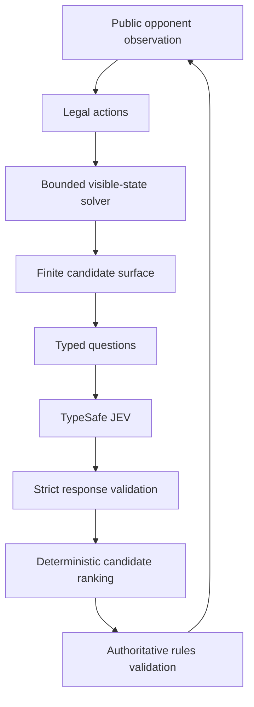
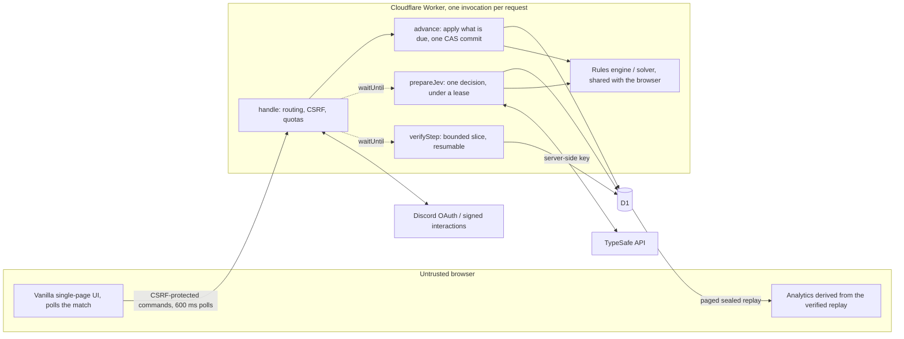
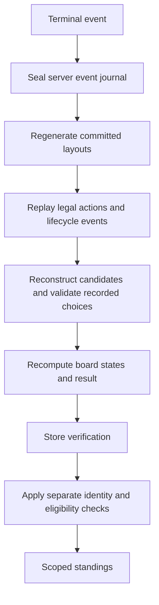

# Implemented architecture: A–Z

This document maps the requested architecture to the delivered implementation. The original attachment is preserved as `original-request.md`. Details here describe implementation choices, not additional statements contained in the original attachment.

## A. Game interpretation

One human and one opponent play simultaneously on separate independently generated layouts. Presets are 9×9/10, 16×16/40, and 30×16/99. Both open the human's selected starting coordinate with the cell and its existing neighbors protected. First clear wins; same 100-ms interval draws. One mine hit freezes that board while the other must still clear. Both explosions or a 15-minute uncleared deadline draw. Started resignation/30-second abandonment loses. Independent layouts have equal parameters, not guaranteed equal puzzle difficulty.

## B. Player experience

Guest and Discord-authenticated players use the same single-page interface. New game creates covered server boards and commitments; the first reveal starts time. The opponent moves on a one-second schedule. Live progress is public-only. Endgame unlocks reports, private replay, history, and exports. No-key play is labeled local/unofficial. Login after a guest game does not retroactively award rank.

## C. Rules engine

`public/shared/engine.js` owns deterministic state transitions. `createMatch`, `generateBoard`, `startMatch`, `getLegalActions`, `applyBoardAction`, `applyMatchAction`, `adjudicate`, and observation projectors are independent of DOM and network. Private state stores dimensions, seeds, commitments, mine/adjacency arrays, flags/reveals, revisions, counts/status, shared time, and outcome. Public projections contain only revealed numbers, covered/flagged states, and public counters. Revealing a mine is a legal losing action. Unsafe chording explodes even when it simultaneously reveals the last safe cell.

## D. JEV decision model

The observation-only solver supplies explicit legal candidates. Easy/Normal use direct or direct+subset deductions. Hard/JEV add bounded component enumeration. Exact component assignment distributions are convolved and weighted by compatible global placements. Flags are not assumed correct. Deterministic pruning, protected proofs, risk, continuation score, choice preference, and stable coordinate ordering determine the selected action.



## E. JEV state encoding

Readable covered/flagged/revealed grid, dimensions/mine count, computed constraints, bounded candidates, and policy metadata go to TypeSafe. Never send mine locations, private seeds, hidden adjacency, Discord identity, credentials in state, or truth-derived flag correctness. Requests use Choice for candidate preference, Noul for unknown safety, and Score for continuation. The response is validated against expected keys, probabilities, model, schema, candidates, and revision/hash. Request size is capped at 24 KiB; at most 32 candidates. Selection confidence is not mine safety. Only explicit evidence templates are displayed.

## F. Runtime architecture

Production is a Cloudflare Worker with D1 and Static Assets (Workers Free plan: 10 ms CPU per invocation, no background threads, no long-lived connections, no cron). The application is one `handle(request, env, ctx)` written against Web APIs (`server/worker.js`); `env.DB` is D1, `env.ASSETS` is `public/`. Locally `server/main.js` adapts Node's `http` to the same function and gives it `node:sqlite` behind a D1-compatible wrapper (`server/local-db.js`), so the tests run against real SQLite.



**No coordinator.** The old process kept matches in memory with a 50 ms timer, an SSE stream and worker threads. None of that exists on Workers, so time is applied lazily. Every owner request first runs `advance()`: the opponent's one-per-second moves, 100 ms clear adjudication, both-exploded/deadline draws, ready expiry (2 min), abandonment (30 s without owner contact) and the action limit are replayed in time order, each event stamped at the instant it was due (not when the request arrived), and appended with the request's own command in **one compare-and-swap commit** (`UPDATE matches ... WHERE version=?`, dependent inserts guarded by a unique write tag inside a D1 batch). A concurrent invocation makes the guard match nothing and the loser retries on the new state. Idempotency keys are unique per match and carry a body hash; changed bodies conflict.

**Opponent decisions run ahead of the clock.** The opponent's board never depends on the human's, so `prepareJev()` (run with `waitUntil`, under a durable D1 lease so only one runs) speculatively applies the already-queued moves to a private copy of the opponent's board, asks the solver/model for the next decision from that board's *public observation only*, and queues it in `jev_decisions` (default depth 3). `advance()` applies a queued decision at `max(its due time, when it became ready)`; a decision late by more than 100 ms, or a slot that passed with nothing ready (for example because the client stopped polling), marks the match `scheduling_miss` and unranks it. Stale queue entries (observation hash or revision mismatch) are discarded and unrank the match. `local`, `forced` and `fallback` decisions keep their labels; `source: "jev"` only follows a validated real model response. After two consecutive failed attempts at one position (a killed invocation, for example CPU limit) the next attempt uses the cheapest solver budget, is recorded `cpu_guard`, is never ranked, and is replayed under the same reduced budget by the verifier.

**One heavy thing per invocation.** Commands never carry background work; a poll that already applied opponent moves defers the next decision to the following poll unless the queue would run dry; a finished match's verification is advanced only by polls (and by maintenance for orphaned matches).

**Verification is resumable.** The finished journal is verified by the same `ReplayVerifier` as `verifyReplay()`, a slice at a time (`VERIFY_STEP_UNITS` budget, always at least one event), with a persisted cursor and a lease. A bad journal rejects the match; a database error only retries. Eligibility is written only when the whole journal verifies.

**Analytics are derived in the browser.** Recomputing the solver for every action of both boards (the analytics do) is far beyond 10 ms, and it does not affect ranking, so the server serves the sealed, verified replay (paged) plus its own operational audit rows, and `public/shared/analytics.js` produces the dashboard and CSV/JSON exports client-side, as offline practice already did. The metrics are unchanged; the analytics version is `ms-analytics-1.1.0`.

**Housekeeping without cron.** One 20 s-guarded maintenance job (rotating: prune, settle idle matches, verify an orphaned match) rides on `/api/me`, `/api/health` and `/api/leaderboard`.

## G. Security boundaries

The browser requests commands, never supplies authoritative layouts, scores, time, actor identity, or guild/channel context. Secrets and private state remain on the host. Ownership, CSRF, Origin, request allowlists, revision validation, idempotency, rate limits, signed interactions, and replay verification form the boundary. Worker input for opponent solving is public only. Post-game analytics uses hidden truth only after sealing.

## H. Discord authentication

```mermaid
sequenceDiagram
  participant B as Browser
  participant A as Application
  participant D as Discord
  participant S as Session store
  B->>A: Begin login
  A->>S: Store one-time state hash and expiry
  A-->>B: OAuth redirect (identify)
  B->>D: Authorize
  D-->>B: Callback code and state
  B->>A: Callback
  A->>S: Validate and consume state
  A->>D: Server-side token exchange / identity lookup
  A->>S: Rotate session; save minimal profile
  A-->>B: HttpOnly cookie and same-origin redirect
```

User login requests `identify`, not email/guild listing. Store user ID, display name, validated avatar reference, and timestamps. OAuth access/refresh tokens are not persisted. Session absolute expiry is 24 hours, idle expiry 60 minutes. Production cookies are Secure, HttpOnly, host-only, SameSite=Lax with the `__Host-` prefix.

## I. Discord community context

A commands-only guild-installed application receives `/jev play` over signed HTTP interactions. Verify Ed25519 over exact raw bytes and timestamp, application ID, member ID, guild/channel IDs, ordinary text-channel type, and replay uniqueness. Return an opaque ten-minute one-use launch capability bound to the invoking user. Its fragment keeps it out of HTTP request paths. An authenticated POST consumes it and creates a 30-minute session context grant. This proves launch context, not continuous present-day membership or permission. No Gateway or privileged message-reading bot is required.

## J. Scoring

Native W/L/D, actual clears, time, command counts, and streaks; no arbitrary points or Elo. Clear-win rate includes draws in the denominator. A JEV explosion alone does not create a human win. First-opening-only clears are excluded from rank. Service-degraded results remain visible as unofficial.

## K. Leaderboards

World is public; Server and Channel require the corresponding unexpired context grant. Store each result once and filter by scope. Twenty eligible completed matches qualify a player for a rank. Sort win rate, then games, then best actual clear, then stable ID. Provisional players follow qualified players. Filter by preset, reasoning level, week/all-time, and exact versioned competition key. Pagination is fifty entries; weekly boundary Monday 00:00 UTC. A version change begins a distinct competitive configuration.

## L. Persistent schema

`migrations/0001_init.sql` is the schema (D1 migrations; the local shim applies the same file). Tables: users, sessions, launch_tickets, matches, match_events, jev_decisions (queued opponent decisions), audit_events, counters (durable quotas and the maintenance tick). Match rows carry configuration, private state, eligibility/reasons, verification and its cursor, outcome, timings, sealed head hash, the CAS `version`/`write_tag`, journal head (`event_count`, `head_hash`), owner contact time, the opponent schedule and provider-call count, and the prepare/verify leases. There is no cached analytics column. Indexes cover active-owner uniqueness, player history, scope standings, pending verification, live matches and retention. D1 enforces foreign keys and runs each batch as one transaction.

## M. API

`API.md` defines every route. Commands are POSTs; the match is read by polling `GET /api/matches/:id`. There is no score-submission endpoint. A duplicate command ID with an identical body returns the original acceptance sequence plus a current snapshot; changed bodies conflict. Human revisions are independent of opponent revisions.

## N. Result verification



A legal replay alone would not stop a browser that already knew the mines. Therefore private generation and online validation precede replay checks. Replay verification rechecks model/policy, observation hashes, candidate sets, recorded outputs, selected action, event chain, monotonic time, state revisions, and final result. Scheduling eligibility is enforced by the live coordinator; replay rule verification alone is not a proof of real-world punctuality or unaided human play.

## O. Replay format

Versioned JSON contains engine/generator/policy, config, two seeds/commitments, ordered hash-chained events, structured applied decisions, final head hash, result, and metadata. Seeds are released only after sealing. Reproduction uses recorded decisions, never a fresh model answer. Owner-only exports have no public sharing token. The server serves the replay in pages (a long match is megabytes) that the client concatenates back into the exact document. Event JSONL supports analysis but does not independently replace the full replay envelope.

## P. User interface

Desktop: side-by-side human/opponent boards and a structured decision panel, then live metrics and tabbed analysis/history/standings/help. Mobile stacks these sections and scrolls wide boards locally. Controls: reveal, explicit flag mode, right-click/F, chord via C/double-click, arrow navigation, Enter/Space. The 44-pixel option favors large touch targets over fitting all expert columns onscreen. Charts have tables; text and accessible labels never reveal hidden numbers. Focus/reduced-motion features are implemented, not independently accessibility-certified.

## Q. File structure

`public/` holds the presentation, network and offline modules **and** `public/shared/` (rules, solver, decision schema, replay, analytics), which the Worker imports and the browser loads from the same files. `server/` holds `worker.js` (entry and routing), `matches.js` (lifecycle), `security.js`, `discord.js`, `activity.js`, `jev.js`, `db.js` (async D1 layer), `config.js`, plus the local-only `main.js` and `local-db.js`. `migrations/`, `wrangler.jsonc`, `tests/`, `bench/`, `scripts/`, `docs/` and `reports/` have explicit responsibilities. There is no bundler, ORM or plugin bus.

## R. Dependencies

Production: Cloudflare Workers, D1 and Static Assets (Web APIs and Web Crypto only; no `nodejs_compat`). Actual JEV uses the TypeSafe service; authentication uses Discord. Local development needs Node 22.16+ (built-in `node:sqlite`). The browser has no third-party runtime scripts. Wrangler is fetched by `npx` at deploy time and is not a project dependency. Python Playwright/Chromium are optional development-only UI-test tools.

## S. Tests

Rules, deterministic generation vectors, actions/chords/race boundaries, observations, solver proofs/exact probabilities, candidate caps, response parsing, malformed/timeout/fallback handling, OAuth mocks, real cryptographic signature fixtures, ownership/CSRF, HTTP/SSE, replay tampering, SQL transactions, CSV defenses, aggregation, and leaderboards are automated. Scheduler, verification, quota, degradation and Workers-compatibility tests run the real handler on real SQLite through the D1 wrapper with a controllable clock and provider. Chromium UI checks (not re-run for the Workers port) cover desktop/mobile/local offline and exports. `TESTING.md` states execution conditions and the DOM-bridge limitation.

## T. Benchmarking

`bench/run.js` runs identical committed board inputs across deterministic random, easy-local, normal-local, hard-local, and jev-local policies. Independent-board race comparisons pair and swap layouts. Logical one-second action time is separate from measured computation latency. Explicit `--remote` adds real provider calls only with a supplied key. Output includes every game/action trace, summary CSV/JSON, Wilson clear intervals, and race tables. The bundled run is 500 **local** games; do not relabel it as JEV strength. `bench/cpu.js` (`npm run bench:cpu`) measures the CPU of each hot request path against the 10 ms Workers budget and writes `reports/cpu/`.

## U. Deployment

Cloudflare Workers Free + D1 + Static Assets at `minesweeper.jevplay.games`; see `DEPLOYMENT.md` for the operator steps, the Free-plan budget and the CPU measurements. It is not a distributed tournament platform: capacity is bounded by 100 k Worker requests/day, D1's write allowance and the 10 ms CPU limit, with durable daily caps in front of them.

## V. Implementation phases delivered

Core engine; local UI; authoritative coordinator and persistence; solver/JEV boundary; replay verification; detailed analytics and exports; Discord identity/context; scoped standings; browser/HTTP regression checks; local baseline benchmark; deployment documentation. These are implemented in the package. Live credential, Cloudflare deployment, real browser direct-navigation integration, and production load validation are **deployment gates still to run**, not completed release claims.

## W. Risks and open questions

Actual remote JEV strength/latency is unmeasured here. Layout randomness affects individual races. Browser assistance cannot be ruled out. Provider availability/schema changes need smoke testing. The Free plan bounds scale (requests/day, D1 writes, 500 MB database); CPU measurements are from Node's V8, not workerd, and a cold isolate is slower than a warm one. Applied-decision token usage is not a complete billing ledger. Audit retention and cached operational reports have explicit coverage limits. Guild context does not provide continuous membership revocation. No external security certification or production load test was performed.

## X. Simplification pass

Removed third-party runtime packages, bundlers, ORMs, generic agent frameworks, Elo, public replay sharing, chat, spectators, background client telemetry, continuous bot membership synchronization, and no-guess board claims. Kept the server-held information boundary, ownership/context checks, worker budgets, replay verification, and version isolation because removing them changes correctness or trust.

## Y. Deployable functional scope

Playable two-board races with three presets/four reasoning levels; clearly labeled local and actual-provider paths; private detailed analytics and exports; login/community launch; verified standings; local replay; tests and benchmark scripts. A host must configure and validate external services before advertising official remote-JEV rankings.

## Z. Next implementation step

On the intended deployment runtime, start a staging instance with actual TypeSafe and Discord credentials. Complete one signed Discord launch, a real JEV match, a scoped leaderboard qualification fixture, a provider-timeout failure, and an owner-only export/replay check through a normally navigating browser. Record observed latency/usage and test results before enabling public ranked admission.
