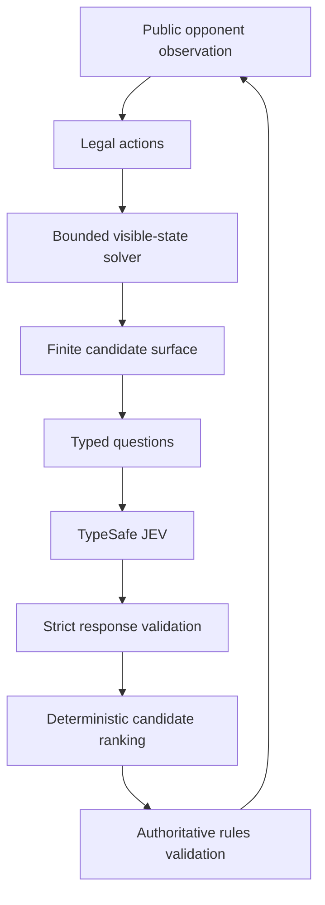
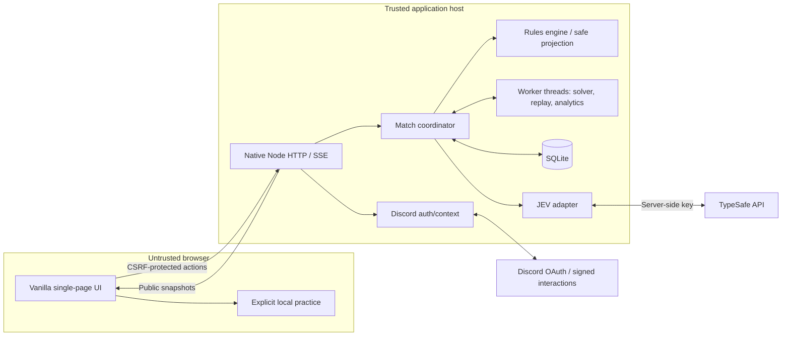
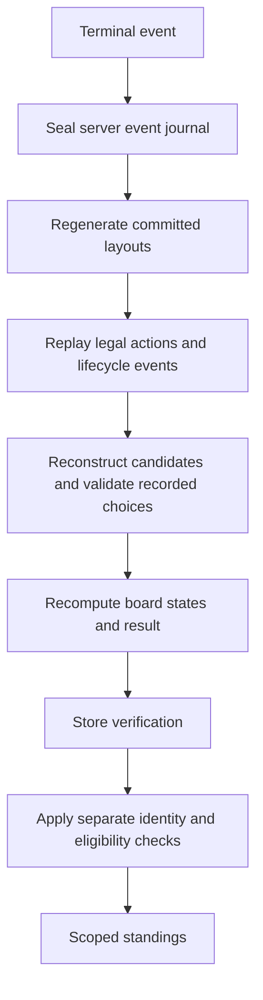

# Implemented architecture: A–Z

This document maps the requested architecture to the delivered implementation. The original attachment is preserved as `original-request.md`. Details here describe implementation choices, not additional statements contained in the original attachment.

## A. Game interpretation

One human and one opponent play simultaneously on separate independently generated layouts. Presets are 9×9/10, 16×16/40, and 30×16/99. Both open the human's selected starting coordinate with the cell and its existing neighbors protected. First clear wins; same 100-ms interval draws. One mine hit freezes that board while the other must still clear. Both explosions or a 15-minute uncleared deadline draw. Started resignation/30-second abandonment loses. Independent layouts have equal parameters, not guaranteed equal puzzle difficulty.

## B. Player experience

Guest and Discord-authenticated players use the same single-page interface. New game creates covered server boards and commitments; the first reveal starts time. The opponent moves on a one-second schedule. Live progress is public-only. Endgame unlocks reports, private replay, history, and exports. No-key play is labeled local/unofficial. Login after a guest game does not retroactively award rank.

## C. Rules engine

`shared/engine.js` owns deterministic state transitions. `createMatch`, `generateBoard`, `startMatch`, `getLegalActions`, `applyBoardAction`, `applyMatchAction`, `adjudicate`, and observation projectors are independent of DOM and network. Private state stores dimensions, seeds, commitments, mine/adjacency arrays, flags/reveals, revisions, counts/status, shared time, and outcome. Public projections contain only revealed numbers, covered/flagged states, and public counters. Revealing a mine is a legal losing action. Unsafe chording explodes even when it simultaneously reveals the last safe cell.

## D. JEV decision model

The observation-only solver supplies explicit legal candidates. Easy/Normal use direct or direct+subset deductions. Hard/JEV add bounded component enumeration. Exact component assignment distributions are convolved and weighted by compatible global placements. Flags are not assumed correct. Deterministic pruning, protected proofs, risk, continuation score, choice preference, and stable coordinate ordering determine the selected action.



## E. JEV state encoding

Readable covered/flagged/revealed grid, dimensions/mine count, computed constraints, bounded candidates, and policy metadata go to TypeSafe. Never send mine locations, private seeds, hidden adjacency, Discord identity, credentials in state, or truth-derived flag correctness. Requests use Choice for candidate preference, Noul for unknown safety, and Score for continuation. The response is validated against expected keys, probabilities, model, schema, candidates, and revision/hash. Request size is capped at 24 KiB; at most 32 candidates. Selection confidence is not mine safety. Only explicit evidence templates are displayed.

## F. Runtime architecture



Caddy is optional same-origin HTTPS termination. The Node server also serves a strict allowlist of static files. Native SQLite replaces the earlier proposed third-party SQLite package; this removes all production npm dependencies. The Node 22.16 runtime used in tests marks SQLite experimental, so newer-runtime deployment still needs its own smoke test.

## G. Security boundaries

The browser requests commands, never supplies authoritative layouts, scores, time, actor identity, or guild/channel context. Secrets and private state remain on the host. Ownership, CSRF, Origin, request allowlists, revision validation, idempotency, rate limits, signed interactions, and replay verification form the boundary. Worker input for opponent solving is public only. Post-game analytics uses hidden truth only after sealing.

## H. Discord authentication

```mermaid
sequenceDiagram
  participant B as Browser
  participant A as Application
  participant D as Discord
  participant S as Session store
  B->>A: Begin login
  A->>S: Store one-time state hash and expiry
  A-->>B: OAuth redirect (identify)
  B->>D: Authorize
  D-->>B: Callback code and state
  B->>A: Callback
  A->>S: Validate and consume state
  A->>D: Server-side token exchange / identity lookup
  A->>S: Rotate session; save minimal profile
  A-->>B: HttpOnly cookie and same-origin redirect
```

User login requests `identify`, not email/guild listing. Store user ID, display name, validated avatar reference, and timestamps. OAuth access/refresh tokens are not persisted. Session absolute expiry is 24 hours, idle expiry 60 minutes. Production cookies are Secure, HttpOnly, host-only, SameSite=Lax with the `__Host-` prefix.

## I. Discord community context

A commands-only guild-installed application receives `/jev play` over signed HTTP interactions. Verify Ed25519 over exact raw bytes and timestamp, application ID, member ID, guild/channel IDs, ordinary text-channel type, and replay uniqueness. Return an opaque ten-minute one-use launch capability bound to the invoking user. Its fragment keeps it out of HTTP request paths. An authenticated POST consumes it and creates a 30-minute session context grant. This proves launch context, not continuous present-day membership or permission. No Gateway or privileged message-reading bot is required.

## J. Scoring

Native W/L/D, actual clears, time, command counts, and streaks; no arbitrary points or Elo. Clear-win rate includes draws in the denominator. A JEV explosion alone does not create a human win. First-opening-only clears are excluded from rank. Service-degraded results remain visible as unofficial.

## K. Leaderboards

World is public; Server and Channel require the corresponding unexpired context grant. Store each result once and filter by scope. Twenty eligible completed matches qualify a player for a rank. Sort win rate, then games, then best actual clear, then stable ID. Provisional players follow qualified players. Filter by preset, reasoning level, week/all-time, and exact versioned competition key. Pagination is fifty entries; weekly boundary Monday 00:00 UTC. A version change begins a distinct competitive configuration.

## L. Persistent schema

`server/schema.sql` is the executable concrete schema. Six tables: users, sessions, launch tickets, matches, match events, and audit events. Match rows contain configuration, private state, eligibility/reasons, verification, outcome, timings, sealed head hash, and cached analytics. Journal rows have ordered events, unique request IDs, and request-body hashes. Audit rows are operational evidence separate from accepted moves. Indexes cover active-owner uniqueness, player history, scope standings, and audit retention. SQLite foreign keys, WAL, prepared parameters, busy timeout, and transactions are enabled. Schema version is 1; no multi-version migration framework is included.

## M. API

`API.md` defines every route and payload. Native HTTP handles commands and export reads; SSE carries public snapshots. No browser score-submission endpoint exists. A duplicate command ID with an identical body returns the original acceptance sequence plus a current snapshot without reapplying it. Changed bodies conflict. Human revisions are independent of opponent revisions.

## N. Result verification



A legal replay alone would not stop a browser that already knew the mines. Therefore private generation and online validation precede replay checks. Replay verification rechecks model/policy, observation hashes, candidate sets, recorded outputs, selected action, event chain, monotonic time, state revisions, and final result. Scheduling eligibility is enforced by the live coordinator; replay rule verification alone is not a proof of real-world punctuality or unaided human play.

## O. Replay format

Versioned JSON contains engine/generator/policy, config, two seeds/commitments, ordered hash-chained events, structured applied decisions, final head hash, result, and metadata. Seeds are released only after sealing. Reproduction uses recorded decisions, never a fresh model answer. Owner-only exports have no public sharing token. Event JSONL supports analysis but does not independently replace the full replay envelope.

## P. User interface

Desktop: side-by-side human/opponent boards and a structured decision panel, then live metrics and tabbed analysis/history/standings/help. Mobile stacks these sections and scrolls wide boards locally. Controls: reveal, explicit flag mode, right-click/F, chord via C/double-click, arrow navigation, Enter/Space. The 44-pixel option favors large touch targets over fitting all expert columns onscreen. Charts have tables; text and accessible labels never reveal hidden numbers. Focus/reduced-motion features are implemented, not independently accessibility-certified.

## Q. File structure

`public/` contains presentation/network/offline modules. `shared/` holds rules, solver, decision schema, replay, and analytics. `server/` holds trusted routing/coordinator, security/Discord, SQLite and workers. `tests/`, `bench/`, `scripts/`, `deploy/`, `docs/`, and `reports/` have explicit responsibilities. There is no generalized plugin bus, dependency-injection framework, frontend bundler, or ORM.

## R. Dependencies

Production: supported Node runtime with native HTTP, crypto, fetch, workers, and SQLite; actual JEV uses TypeSafe service and authentication uses Discord. Optional Caddy provides HTTPS. Browser has no third-party runtime scripts. Python Playwright/Chromium are optional development-only UI-test tools. No font/image/CDN dependency. Native browser APIs cannot securely hold trusted secrets or persist authoritative shared results, hence the server.

## S. Tests

Rules, deterministic generation vectors, actions/chords/race boundaries, observations, solver proofs/exact probabilities, candidate caps, response parsing, malformed/timeout/fallback handling, OAuth mocks, real cryptographic signature fixtures, ownership/CSRF, HTTP/SSE, replay tampering, SQL transactions, CSV defenses, aggregation, and leaderboards are automated. Chromium UI checks cover desktop/mobile/local offline and exports. `TESTING.md` states execution conditions and the DOM-bridge limitation.

## T. Benchmarking

`bench/run.js` runs identical committed board inputs across deterministic random, easy-local, normal-local, hard-local, and jev-local policies. Independent-board race comparisons pair and swap layouts. Logical one-second action time is separate from measured computation latency. Explicit `--remote` adds real provider calls only with a supplied key. Output includes every game/action trace, summary CSV/JSON, Wilson clear intervals, and race tables. The bundled run is 500 **local** games; do not relabel it as JEV strength.

## U. Deployment

One persistent Node process, one SQLite file, two worker threads, optional Caddy. Default admission cap eight active matches and bounded provider calls per match. Single host, not a distributed system. Back up with the included VACUUM INTO utility and integrity check; never casually copy only a live WAL database file. Restarted matches are voided. See DEPLOYMENT.md for host/container examples and pre-launch gates.

## V. Implementation phases delivered

Core engine; local UI; authoritative coordinator and persistence; solver/JEV boundary; replay verification; detailed analytics and exports; Discord identity/context; scoped standings; browser/HTTP regression checks; local baseline benchmark; deployment documentation. These are implemented in the package. Live credential, public TLS, real browser direct-navigation integration, and production load validation are **deployment gates still to run**, not completed release claims.

## W. Risks and open questions

Actual remote JEV strength/latency is unmeasured here. Layout randomness affects individual races. Browser assistance cannot be ruled out. Provider availability/schema changes need smoke testing. SQLite and a single process bound scale. Applied-decision token usage is not a complete billing ledger. Audit retention and cached operational reports have explicit coverage limits. Guild context does not provide continuous membership revocation. No external security certification or production load test was performed.

## X. Simplification pass

Removed third-party runtime packages, bundlers, ORMs, generic agent frameworks, Elo, public replay sharing, chat, spectators, background client telemetry, continuous bot membership synchronization, and no-guess board claims. Kept the server-held information boundary, ownership/context checks, worker budgets, replay verification, and version isolation because removing them changes correctness or trust.

## Y. Deployable functional scope

Playable two-board races with three presets/four reasoning levels; clearly labeled local and actual-provider paths; private detailed analytics and exports; login/community launch; verified standings; local replay; tests and benchmark scripts. A host must configure and validate external services before advertising official remote-JEV rankings.

## Z. Next implementation step

On the intended deployment runtime, start a staging instance with actual TypeSafe and Discord credentials. Complete one signed Discord launch, a real JEV match, a scoped leaderboard qualification fixture, a provider-timeout failure, and an owner-only export/replay check through a normally navigating browser. Record observed latency/usage and test results before enabling public ranked admission.
